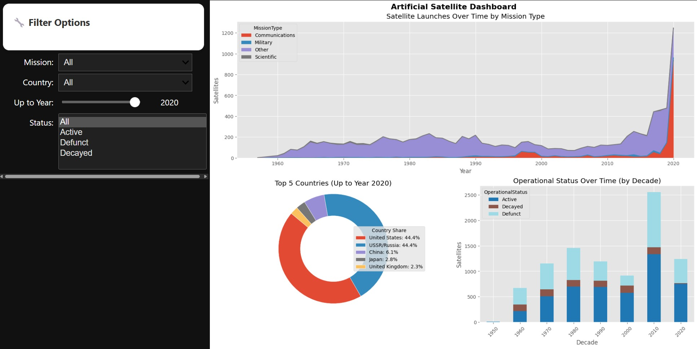

# Satellite Data Visualization for the Johnson Geo Centre

### 📊 A Data Storytelling Project on Global Satellite Activity Using Python

<p align="center">
  
</p>
<p align="center">
  <em>Above: 36" x 24" infographic summarizing global satellite activity across countries and sectors.</em>
</p>

<p align="center">
  
</p>
<p align="center">
  <em>Above: Snapshot of the interactive dashboard enabling exploration of satellite trends by country, year, and purpose.</em>
</p>

---

## Overview
This project was developed as part of **COMP 4304 – Data Visualization** at Memorial University.

The goal was to create a compelling data story about artificial satellites in orbit, using the **General Catalog of Artificial Space Objects (GCAT)** dataset curated by Jonathan McDowell. The final deliverables included:

- ✅ A **large-format infographic** (36×24 inches) designed for public display.
- ✅ An **interactive dashboard** built with Python for data exploration.

---

## Key Features

### Infographic (Static Visualization)
- Created using **Matplotlib** and **Seaborn**
- Highlights:
  - Growth of private-sector satellites post-2015
  - Country-wise launch dominance (USA, China, Russia)
  - Historical spikes during the space race, Cold War, and commercial booms
- Designed for general public display and understanding

### Interactive Dashboard
- Built using **ipywidgets** and deployed via **Voila**
- Enables interactive exploration of:
  - Satellite purposes (Communication, Navigation, Military, etc.)
  - Launch counts by country and decade
  - Trends across orbital types and nations
- Includes dropdowns, sliders, and filters

---

## Data Source
- **GCAT Satellite Catalog** (`satcat.tsv`)
  - Source: Jonathan McDowell
  - Website: [https://planet4589.org/space/gcat](https://planet4589.org/space/gcat)

---

## Tools & Technologies
- Python 3.11
- Pandas, NumPy
- Matplotlib, Seaborn, Plotly
- ipywidgets, Voila
- Jupyter Notebooks

---

## Learning Outcomes
- Applied storytelling principles in scientific communication
- Built high-quality static and interactive visualizations from raw datasets
- Practiced full-cycle data storytelling: from data cleaning → visual design → interactivity
- Focused on clarity, accessibility, and interpretability for public audiences

---

## Acknowledgements
- This project was completed under the guidance of **Professor Terrence Tricco** at Memorial University.
- Part of a course project for submission to the **Johnson Geo Centre**'s updated *Our Future & Space* exhibit.

---

## How to Run
1. Clone the repository:
   ```bash
   git clone https://github.com/yuvraj-kalsi0001/Satellite-Data-Visualization-Project
   ```
2. Open the Jupyter notebooks for the infographic and dashboard.
3. For the dashboard, run:
   ```bash
   voila interactive_dashboard.ipynb
   ```

---

> 🔗 Feel free to fork and star this project if you find it insightful!
